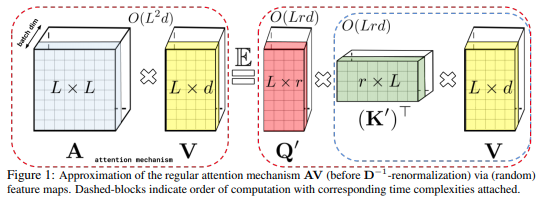

# scale-up-transformer

This repository contains the early study and code for the paper "[UniXGen: A Unified Vision-Language Model for Multi-View Chest X-ray Generation and Report Generation.](https://openreview.net/pdf?id=xVNY6Th44d)" by Hyungyung Lee, <u>Da Young Lee</u>, Wonjae Kim, Jin-Hwa Kim, Tackeun Kim, Jihang Kim, Leonard Sunwoo5, Edward Cho.

</img>

This research is based on <a href="https://arxiv.org/abs/2009.14794">Performer</a>, a linear attention-based transformer variant with a **F**ast **A**ttention **V**ia positive **O**rthogonal **R**andom features approach (FAVOR+).


</img>


## Citations

```bibtex
@article{kim2023unixgen,
  title={UniXGen: A Unified Vision-Language Model for Multi-View Chest X-ray Generation and Report Generation},
  author={Lee, Hyungyung and Lee, Da Young and Kim, Wonjae and Kim, Jin-Hwa and Kim, Tackeun and Kim, Jihang and Sunwoo, Leonard and Choi, Edward},
  journal={arXiv preprint arXiv:2302.12172},
  year={2023}
}
```
